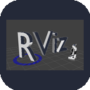
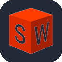
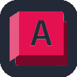
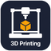

  

# print("Hello World! I'm Lucy.")

🎓 **Graduate Candidate in Robotics and Automation at Drexel University**

## Skills

<table>
<tr>
<th align="left">Category</th>
<th align="left">Technologies</th>
</tr>

<tr>
<td><b>💻 Software | Programming</b></td>
<td>

</td>
</tr>

<tr>
<td><b>🛠️ Software | Development Tools</b></td>
<td>

</td>
</tr>

<tr>
<td><b>🤖 Robotics Engineering</b></td>
<td>

</td>
</tr>

<tr>
<td><b>📍 Planning & Control</b></td>
<td>

</td>
</tr>

<tr>
<td><b>🧠 AI & Machine Learning</b></td>
<td>

</td>
</tr>

<tr>
<td><b>⚙️ Mechanical & CAD Design</b></td>
<td>

</td>
</tr>

<tr>
<td><b>🔌 Electronics & Hardware</b></td>
<td>

</td>
</tr>

</table>

  

